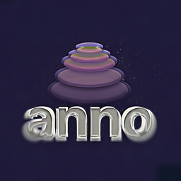

# anno

<div align="center">
  
</div>

Information extraction for Rust: NER, cross-document entity coalescing, hierarchical clustering.

[](https://github.com/arclabs561/anno/actions)
[](https://crates.io/crates/anno)
[](https://docs.rs/anno)

anno is a library and command line tool for extracting named entities from text, coalescing mentions across documents into canonical entities, and stratifying entities into hierarchical clusters. Swap between regex (~400ns), transformers (~50-150ms), zero-shot NER without code changes.

**Extract. Coalesce. Stratify.**

## Installation

```bash
cargo install anno-cli
# or from source:
git clone https://github.com/arclabs561/anno
cd anno && cargo build --release
```

## Usage

```bash
# Extract entities from text
anno extract "Marie Curie won the Nobel Prize in Paris"

# Cross-document entity coalescing (merge mentions across documents)
anno crossdoc --directory ./docs --threshold 0.6
# or: anno coalesce --directory ./docs --threshold 0.6

# Hierarchical clustering (reveal strata of abstraction)
anno strata --input graph.json --method leiden --levels 3

# Full pipeline: extract → coalesce → stratify
anno pipeline ./docs/ --output ./kb/
```

## Library

```toml
[dependencies]
anno = "0.2"
```

## Structure

```
anno-core/      # Foundation: Entity, GroundedDocument, GraphDocument
anno/           # NER backends, evaluation framework
anno-coalesce/  # Cross-document entity resolution
anno-strata/    # Hierarchical clustering (Leiden, RAPTOR)
anno-cli/       # Unified CLI binary
```

**Dependency flow:**
```
anno-core (no deps)
    ↑
    ├── anno
    ├── anno-coalesce
    └── anno-strata
            ↑
            └── anno-cli
```

## Pipeline

### Extract

Detect entities in text: persons, organizations, locations, dates, etc.

```rust
use anno::{Model, RegexNER};

let ner = RegexNER::new();
let entities = ner.extract_entities("Contact alice@acme.com by Jan 15", None)?;
// EMAIL: "alice@acme.com" [8, 22)
// DATE: "Jan 15" [26, 32)
```

### Coalesce

Cross-document entity resolution: merge mentions across documents into canonical entities.

- **Input**: entities from multiple documents
- **Output**: canonical entities (Identity) linking mentions across documents
- **Purpose**: Identity resolution - "Marie Curie" in doc1 and "Marie Curie" in doc2 → same Identity
- **Algorithm**: Similarity-based clustering (embeddings or string similarity)
- **Example**: `anno crossdoc --directory ./docs --threshold 0.6`

```rust
use anno_coalesce::Resolver;

let resolver = Resolver::new();
let identities = resolver.resolve_inter_doc_coref(&mut corpus, Some(0.7), Some(true))?;
```

### Stratify

Hierarchical community detection: reveal layers of abstraction (communities, themes).

- **Input**: graph of entities and relations (GraphDocument)
- **Output**: hierarchical layers of communities at multiple resolutions
- **Purpose**: Reveal abstraction levels (specific entities → themes → domains)
- **Algorithm**: Leiden algorithm at multiple resolutions (modularity optimization)
- **Example**: `anno strata --input graph.json --method leiden --levels 3`

```rust
use anno_strata::HierarchicalLeiden;

let hierarchy = HierarchicalLeiden::cluster(&graph)?;
```

**Difference**: Coalesce resolves identity (same entity across docs). Strata organizes into hierarchies (communities, themes, abstraction layers).

## Examples

```rust
use anno::{Model, RegexNER};

let ner = RegexNER::new();
let entities = ner.extract_entities("Contact alice@acme.com by Jan 15", None)?;

for e in &entities {
    println!("{}: \"{}\" [{}, {})", e.entity_type.as_label(), e.text, e.start, e.end);
}
```

### ML-based NER

```rust
use anno::StackedNER;

let ner = StackedNER::default();
let entities = ner.extract_entities("Sarah Chen joined Microsoft in Seattle", None)?;
// PER: "Sarah Chen" [0, 10)
// ORG: "Microsoft" [18, 27)
// LOC: "Seattle" [31, 38)
```

### Zero-shot NER (Type Hints)

Zero-shot backends accept entity type descriptions at runtime (type hints):

```rust
#[cfg(feature = "onnx")]
use anno::{ZeroShotNER, GLiNEROnnx};

#[cfg(feature = "onnx")]
let ner = GLiNEROnnx::new("onnx-community/gliner_small-v2.1")?;

// Type hints: tell the model WHAT to extract
#[cfg(feature = "onnx")]
let entities = ner.extract_with_types(
    "Patient presents with diabetes, prescribed metformin 500mg",
    &["disease", "medication", "dosage"],  // Type hints
    0.5,
)?;

// Or use natural language descriptions
#[cfg(feature = "onnx")]
let entities = ner.extract_with_descriptions(
    text,
    &["a medical condition", "a pharmaceutical compound"],
    0.5,
)?;
```

**Type hints vs Gazetteers:**
- **Type hints** (`extract_with_types`): Tell model WHAT types to extract (semantic matching)
- **Gazetteers** (`Lexicon` trait): Provide exact-match lookup of known entities (not yet integrated into NER pipeline)

## Backends

| Backend | Latency | Accuracy | Feature | Tasks | Use Case |
|---------|---------|----------|---------|-------|----------|
| `RegexNER` | ~400ns | ~95%¹ | always | NER | Structured entities (dates, money, emails) |
| `HeuristicNER` | ~50μs | ~65%² | always | NER | Person/Org/Location heuristics |
| `StackedNER` | ~100μs | varies³ | always | NER | Composable layered extraction |
| `BertNEROnnx` | ~50ms | ~86%⁴ | `onnx` | NER | Fixed 4-type NER (PER/ORG/LOC/MISC) |
| `GLiNEROnnx` | ~100ms | ~92%⁵ | `onnx` | NER | Zero-shot NER (custom types) |
| `NuNER` | ~80ms | ~85%⁶ | `onnx` | NER | Zero-shot NER (token-based) |
| `W2NER` | ~120ms | ~88%⁷ | `onnx` | NER, DiscontinuousNER | Nested/discontinuous spans |
| `GLiNER2` | ~130ms | ~92%⁵ | `onnx`/`candle` | NER, RelationExtraction, TextClassification, HierarchicalExtraction | Multi-task extraction |
| `TPLinker` | ~150ms | placeholder⁸ | `onnx` | NER, RelationExtraction | Joint entity-relation (placeholder) |

**Notes:**

¹ **RegexNER (~95%)**: Pattern accuracy on structured entities only (dates, money, emails, URLs). Not comparable to general NER. Verify: `anno eval --model regex --dataset synthetic` (structured entity subset).

² **HeuristicNER (~65%)**: F1 on Person/Org/Location only. Heuristic rules, no ML. Verify: `anno dataset eval --dataset conll2003 --model heuristic --task ner`.

³ **StackedNER (varies)**: Accuracy depends on composition. Default stack (RegexNER + HeuristicNER) ≈ 70-75% F1 on CoNLL-2003. Custom stacks vary. Verify: `anno benchmark --backends stacked --datasets conll2003`.

⁴ **BertNEROnnx (~86%)**: F1 on CoNLL-2003 (PER/ORG/LOC/MISC). Fixed entity types only. Verify: `anno dataset eval --dataset conll2003 --model bert --task ner`.

⁵ **GLiNER (~92%)**: Zero-shot F1 varies by entity types requested. ~92% is typical for common types (Person, Organization, Location) on CoNLL-2003. Accuracy drops for rare/domain-specific types. Verify: `anno dataset eval --dataset conll2003 --model gliner --task ner`.

⁶ **NuNER (~85%)**: Zero-shot token-based NER. Lower accuracy than GLiNER but faster. Verify: `anno dataset eval --dataset conll2003 --model nuner --task ner`.

⁷ **W2NER (~88%)**: F1 on nested/discontinuous entities. Handles non-contiguous spans (e.g., "New York" in "New ... York"). Verify: `anno dataset eval --dataset cadec --model w2ner --task discontinuous-ner`.

⁸ **TPLinker (placeholder)**: Currently heuristic-based placeholder. Full ONNX implementation pending. Relation extraction accuracy not yet measured. Verify: `anno dataset eval --dataset docred --model tplinker --task re`.

**Tasks:**
- **NER**: All backends support Named Entity Recognition (via `Model` trait)
- **RelationExtraction**: GLiNER2 (via `RelationExtractor` trait), TPLinker (placeholder)
- **DiscontinuousNER**: W2NER (non-contiguous spans, via `DiscontinuousNER` trait)
- **TextClassification**: GLiNER2 (multi-task)
- **HierarchicalExtraction**: GLiNER2 (nested structures)
- **IntraDocCoref**: Coreference resolvers (via `CoreferenceResolver` trait, requires `discourse` feature)
- **AbstractAnaphora**: `DiscourseAwareResolver` only (requires `discourse` feature, not NER backends)

**Note**: Abstract anaphora is a coreference task (resolving "this"/"that" to events/propositions), not an NER task. It requires `DiscourseAwareResolver`, not NER models. Verify: `anno dataset eval --dataset gap --model discourse-aware --task abstract-anaphora`.

**⚠️ Accuracy numbers are not directly comparable**: Different backends handle different entity types and tasks. Use `anno benchmark` for comprehensive evaluation across your specific use case.

## Features

| Feature | What it enables |
|---------|-----------------|
| *(default)* | `RegexNER`, `HeuristicNER`, `StackedNER`, `GraphDocument` |
| `onnx` | BERT, GLiNER, GLiNER2, NuNER, W2NER, TPLinker via ONNX Runtime |
| `candle` | Pure Rust inference (`CandleNER`, `GLiNERCandle`, `GLiNER2Candle`) |
| `eval` | Core metrics (P/R/F1), datasets, evaluation framework |
| `eval-advanced` | Calibration, robustness, OOD detection, `crossdoc`, `strata`, `rank-eval`, relation extraction evaluation |
| `discourse` | Event extraction, abstract anaphora, coreference resolution |

## CLI Commands

| Command | Alias | Purpose |
|---------|-------|---------|
| `extract` | `x` | Extract entities from text |
| `debug` | `d` | HTML visualization with coreference/KB linking |
| `eval` | `e` | Evaluate predictions against gold |
| `validate` | `v` | Validate JSONL annotation files |
| `analyze` | `a` | Deep analysis with multiple models |
| `crossdoc` | `coalesce` | Cross-document entity resolution (identity linking) |
| `strata` | - | Hierarchical community detection (abstraction layers) |
| `pipeline` | `p` | Full pipeline: extract → coalesce → stratify |
| `info` | `i` | Show model and version info |
| `models` | - | List and compare available models |

Run `anno --help` for full command reference.

## Documentation

- **API docs**: https://docs.rs/anno
- **Architecture**: [docs/TOOLBOX_ARCHITECTURE.md](docs/TOOLBOX_ARCHITECTURE.md)
- **Evaluation**: [docs/EVALUATION.md](docs/EVALUATION.md)

## License

MIT OR Apache-2.0
