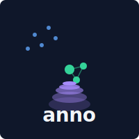

# anno

<div align="center">
  
</div>

Information extraction for Rust: NER, cross-document entity coalescing, hierarchical clustering.

[](https://github.com/arclabs561/anno/actions)
[](https://crates.io/crates/anno)
[](https://docs.rs/anno)

anno is a library and command line tool for extracting named entities from text, coalescing mentions across documents into canonical entities, and stratifying entities into hierarchical clusters. Swap between regex (~400ns), transformers (~50-150ms), zero-shot NER without code changes.

**Extract. Coalesce. Stratify.**

## Installation

```bash
cargo install anno-cli
# or from source:
git clone https://github.com/arclabs561/anno
cd anno && cargo build --release
```

## Usage

```bash
# Extract entities from text
anno extract "Marie Curie won the Nobel Prize in Paris"

# Cross-document entity coalescing (merge mentions across documents)
anno crossdoc --directory ./docs --threshold 0.6
# or: anno coalesce --directory ./docs --threshold 0.6

# Hierarchical clustering (reveal strata of abstraction)
anno strata --input graph.json --method leiden --levels 3

# Full pipeline: extract → coalesce → stratify
anno pipeline ./docs/ --output ./kb/
```

## Library

```toml
[dependencies]
anno = "0.2"
```

## Structure

```
anno-core/      # Foundation: Entity, GroundedDocument, GraphDocument
anno/           # NER backends, evaluation framework
anno-coalesce/  # Cross-document entity resolution
anno-strata/    # Hierarchical clustering (Leiden, RAPTOR)
anno-cli/       # Unified CLI binary
```

**Dependency flow:**
```
anno-core (no deps)
    ↑
    ├── anno
    ├── anno-coalesce
    └── anno-strata
            ↑
            └── anno-cli
```

## Pipeline

### Extract

Detect entities in text: persons, organizations, locations, dates, etc.

```rust
use anno::{Model, RegexNER};

let ner = RegexNER::new();
let entities = ner.extract_entities("Contact alice@acme.com by Jan 15", None)?;
// EMAIL: "alice@acme.com" [8, 22)
// DATE: "Jan 15" [26, 32)
```

### Coalesce

Merge mentions across documents into canonical entities.

```bash
anno crossdoc --directory ./docs --threshold 0.6
```

```rust
use anno_coalesce::Resolver;

let resolver = Resolver::new();
let identities = resolver.resolve_inter_doc_coref(&mut corpus, Some(0.7), Some(true))?;
```

### Stratify

Reveal layers of abstraction: entities → communities → themes.

```bash
anno strata --input graph.json --method leiden --levels 3
```

```rust
use anno_strata::HierarchicalLeiden;

let hierarchy = HierarchicalLeiden::cluster(&graph)?;
```

## Examples

```rust
use anno::{Model, RegexNER};

let ner = RegexNER::new();
let entities = ner.extract_entities("Contact alice@acme.com by Jan 15", None)?;

for e in &entities {
    println!("{}: \"{}\" [{}, {})", e.entity_type.as_label(), e.text, e.start, e.end);
}
```

### ML-based NER

```rust
use anno::StackedNER;

let ner = StackedNER::default();
let entities = ner.extract_entities("Sarah Chen joined Microsoft in Seattle", None)?;
// PER: "Sarah Chen" [0, 10)
// ORG: "Microsoft" [18, 27)
// LOC: "Seattle" [31, 38)
```

### Zero-shot NER

```rust
#[cfg(feature = "onnx")]
use anno::GLiNEROnnx;

#[cfg(feature = "onnx")]
let ner = GLiNEROnnx::new("onnx-community/gliner_small-v2.1")?;
#[cfg(feature = "onnx")]
let entities = ner.extract(
    "Patient presents with diabetes, prescribed metformin 500mg",
    &["disease", "medication", "dosage"],
    0.5,
)?;
```

## Backends

| Backend | Latency | Accuracy | Feature | Use Case |
|---------|---------|----------|---------|----------|
| `RegexNER` | ~400ns | ~95%* | always | Structured entities (dates, money, emails) |
| `HeuristicNER` | ~50μs | ~65% | always | Person/Org/Location heuristics |
| `StackedNER` | ~100μs | varies | always | Composable layered extraction |
| `BertNEROnnx` | ~50ms | ~86% | `onnx` | Fixed 4-type NER (PER/ORG/LOC/MISC) |
| `GLiNEROnnx` | ~100ms | ~92% | `onnx` | Zero-shot NER (custom types) |
| `GLiNER2` | ~130ms | ~92% | `onnx`/`candle` | Multi-task (NER + classification) |

*Pattern accuracy on structured entities only.

## Features

| Feature | What it enables |
|---------|-----------------|
| *(default)* | `RegexNER`, `HeuristicNER`, `StackedNER`, `GraphDocument` |
| `onnx` | BERT, GLiNER, GLiNER2, NuNER, W2NER via ONNX Runtime |
| `candle` | Pure Rust inference (`CandleNER`, `GLiNERCandle`) |
| `eval` | Core metrics (P/R/F1), datasets, evaluation framework |
| `eval-advanced` | Calibration, robustness, OOD detection, `crossdoc`, `strata` |
| `discourse` | Event extraction, abstract anaphora |

## CLI Commands

| Command | Alias | Purpose |
|---------|-------|---------|
| `extract` | `x` | Extract entities from text |
| `debug` | `d` | HTML visualization with coreference/KB linking |
| `eval` | `e` | Evaluate predictions against gold |
| `validate` | `v` | Validate JSONL annotation files |
| `analyze` | `a` | Deep analysis with multiple models |
| `crossdoc` | `coalesce` | Cross-document entity coalescing |
| `strata` | - | Hierarchical clustering |
| `pipeline` | `p` | Full pipeline: extract → coalesce → stratify |
| `info` | `i` | Show model and version info |
| `models` | - | List and compare available models |

Run `anno --help` for full command reference.

## Documentation

- **API docs**: https://docs.rs/anno
- **Architecture**: [docs/TOOLBOX_ARCHITECTURE.md](docs/TOOLBOX_ARCHITECTURE.md)
- **Evaluation**: [docs/EVALUATION.md](docs/EVALUATION.md)

## License

MIT OR Apache-2.0
