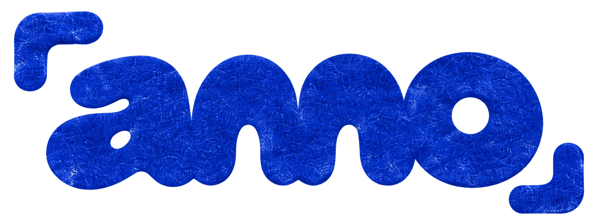

<p align="center">
  
</p>

<h1 align="center">anno</h1>

[](https://crates.io/crates/anno)
[](https://docs.rs/anno)

Text annotation and entity extraction.

Extract entity spans, coreference links, and common forms of personally
identifiable information from text. Model-backed extractors are optional; the
rule-based extractors work offline.

## Library

```toml
[dependencies]
anno = "0.13"
```

```rust
fn main() -> anno::Result<()> {
    let entities = anno::extract("Sophie Wilson designed the ARM processor.")?;
    for entity in entities {
        println!(
            "{} [{}] {}..{}",
            entity.text,
            entity.entity_type,
            entity.start(),
            entity.end()
        );
    }
    Ok(())
}
```

For repeated extraction, create and reuse a model rather than calling
`anno::extract` each time. Offsets are character offsets, not UTF-8 byte
offsets. Confidence scores are backend-local and are not calibrated across
backends.

Pattern-based PII redaction covers values such as email addresses, phone
numbers, and identification numbers:

```rust
use anno::pii;

let text = "John Smith's SSN is 123-45-6789.";
let redacted = pii::redact_patterns(text);
assert_eq!(redacted, "John Smith's SSN is [ID_NUMBER_1].");
```

## CLI

```sh
cargo install anno-cli
```

```console
$ ANNO_NO_DOWNLOADS=1 anno extract --model heuristic --text "Lynn Conway worked at IBM and Xerox PARC in California."
PER:1 "Lynn Conway"
ORG:2 "IBM" "Xerox PARC"
LOC:1 "California"
```

This uses the offline heuristic backend. `anno extract --format json` emits
JSON. Run `anno help <command>` for command options.

## Backends

The default `onnx` feature may download model weights on first use. Set
`ANNO_NO_DOWNLOADS=1` to use only cached or local models; the default stack then
falls back to pattern and heuristic extractors when a model is unavailable.
The [backend guide](docs/BACKENDS.md) lists model identifiers, feature flags,
and hardware requirements.

This crate provides inference and annotation utilities, not model training.
The minimum supported Rust version is 1.91.

Further documentation:

- [Quickstart](docs/QUICKSTART.md)
- [Span and offset contract](docs/CONTRACT.md)
- [References](docs/REFERENCES.md)
- [Examples](crates/anno/examples/)

## License

MIT or Apache-2.0.
